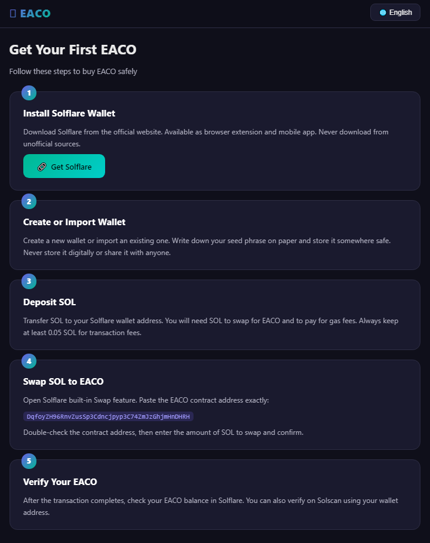

# Web3 EACO Tutorial | 6 Languages | Min Trade \.01

> **Solana AI Community Token Guide - Available in All 6 UN Languages**  
> \DqfoyZH96RnvZusSp3Cdncjpyp3C74ZmJzGhjmHnDHRH\  
> \$\$ [OrbMarkets](https://orbmarkets.io/token/DqfoyZH96RnvZusSp3Cdncjpyp3C74ZmJzGhjmHnDHRH) **|** [Solscan](https://solscan.io/token/DqfoyZH96RnvZusSp3Cdncjpyp3C74ZmJzGhjmHnDHRH) **|** [Solflare](https://solflare.com/)

---

## What is EACO?

EACO is an AI-powered community consensus token built on Solana — designed for global participation with **minimum trade of just \.01**.

### Key Features
- \.01 Minimum Trade — Accessible to everyone
- \~0.25% Trading Fee on Solana
- \~1 Second Settlement
- 24/7 Global Support
- Monthly Consensus Program with rewards

---

## Supported Languages

| | Language | Description |
|---|---|---|
| \🇬🇧 | English | Main documentation |
| \🇨🇳 | 中文 | 最低交易 \.01 |
| \🇪🇸 | Español | Mín. trade \.01 |
| \🇫🇷 | Français | Min. trade \.01 |
| \🇸🇦 | العربية | الحد الأدنى \.01 |
| \🇷🇺 | Русский | Мин. сделка \.01 |

---

## Getting Started

1. **Create Wallet** — Download [Solflare](https://solflare.com/) (min \.01 equivalent in SOL)
2. **Get EACO** — Trade on [OrbMarkets](https://orbmarkets.io/token/DqfoyZH96RnvZusSp3Cdncjpyp3C74ZmJzGhjmHnDHRH) (min just \.01!)
3. **Stake** — 30/90/180/365 days → 1.1x/1.3x/1.5x/2.0x multiplier
4. **Earn** — Daily check-in, promotions, AI tasks, invites

---

## Live Deployment

| Platform | Status |
|----------|--------|
| **GitHub Pages** | \$\$ [eaco-tutorial](https://ucoingroup.github.io/eaco-tutorial/) |
| **Netlify** | [Deploy Free](https://app.netlify.com/drop?name=eaco-tutorial) |
| **Vercel** | [Deploy Free](https://vercel.com/new/clone?repository-url=https://github.com/ucoingroup/eaco-tutorial) |

---

## Auto-Update System

This site is **automatically rebuilt daily at 22:33 Beijing time** via the EACO Auto-Build System.

Built with \\\python + GitHub Pages + Netlify + Vercel\\\

*EACO Global Community — Min Trade \.01 — CA: DqfoyZH96RnvZusSp3Cdncjpyp3C74ZmJzGhjmHnDHRH*


---

## 🚀 Get Your First EACO

### EACO Beginner Guide

Your first EACO token — step by step, safe and simple.

> ⚠️ **Safety Reminders** (Stay Positive and Protected)
>
> - **Your seed phrase = your wallet.** Never share it with anyone, never enter it into any website.
> - **Only use official Solflare and verified links.**
> - **Start small** — test with tiny amounts before moving bigger ones.
> - **Check the contract address twice before every swap.**

### EACO Contract Address (CA)

Always verify this address before any transaction:

```
DqfoyZH96RnvZusSp3Cdncjpyp3C74ZmJzGhjmHnDHRH
```

### Official Explorers

- 🔍 [OrbMarkets](https://orbmarkets.io/token/DqfoyZH96RnvZusSp3Cdncjpyp3C74ZmJzGhjmHnDHRH)
- 🔍 [Solscan](https://solscan.io/token/DqfoyZH96RnvZusSp3Cdncjpyp3C74ZmJzGhjmHnDHRH)

### Get Your First EACO — Step by Step



1. **Install Solflare Wallet**
   Download Solflare from the official website. Available as browser extension and mobile app. Never download from unofficial sources.
   👉 [Get Solflare](https://solflare.com/)

2. **Create or Import Wallet**
   Create a new wallet or import an existing one. Write down your seed phrase on paper and store it somewhere safe. Never store it digitally or share it with anyone.

3. **Deposit SOL**
   Transfer SOL to your Solflare wallet address. You will need SOL to swap for EACO and to pay for gas fees. Always keep at least 0.05 SOL for transaction fees.

4. **Swap SOL → EACO**
   Open Solflare built-in Swap feature. Paste the EACO contract address exactly: `DqfoyZH96RnvZusSp3Cdncjpyp3C74ZmJzGhjmHnDHRH`
   Double-check the contract address, then enter the amount of SOL to swap and confirm.

5. **Verify Your EACO**
   After the transaction completes, check your EACO balance in Solflare. You can also verify on Solscan using your wallet address.

---

*Built with 💜 by EACO Global Community | Min Trade $0.01*
